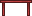
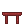
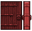
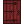

.. _advanced-items:

Advanced Items
==============

Now that you know how to add basic items and art into the game, let's put
together a couple of more advanced items. Crea is built under the
entity-component design philosophy. This means that all base entities start off
the same, and to add more complex functionality, you add self-contained, modular
components to the base entity.

To use an analogy within the game, a basic Workstation is like an entity,
and to craft more complex items, you can add components such as the
Grinding Wheel and the Magnifying Glass.

In this section, we'll be adding Placement, Physics, and Direction Components
to Items as well as making them interactable.

Red Table
---------

The existing small table within Crea is nice and very functional, but let's say
we wanted a red table.

In-game sprite:

In-game icon:

The first image is what the red table will look like in game, and the second
image is what will be displayed when the red table is in our bags.

Now that we have the sprites for our new table, let's write the code that
defines how it functions.

Remember that the engine matches content entity files with images of the same
name. We'll call the .ce file red_table.ce.

Tables are items and they also need to be placeable on the ground. Let's import
the template for Item, as well as for Axis and Support so that we can place the
table on the floor:

.. code-block:: python
   :linenos:

    from core.template.item import Axis, Item

Next, let's define how we want to use that template:

.. code-block:: python
   :linenos:
   :emphasize-lines: 3-9

    from core.template.item import Axis, Item

    redTable = Item(
        name = "RedTable",
        stack = 99,
        useTime = 5
    )

    redTable.placeable(floor_axis=Axis())

And that's all it takes to add an item into Crea! Easy, right? This tells the
Crea engine that there is content called RedTable that can be placed in our
bags in stacks of 99. The last line tells the Crea engine to add a Placement
Component to the item, and that it is placeable on the floor.

Let's place red_table.ce, red_table.png, and red_table_icon.png into the
mods/core/item directory so that the game engine can find them. Now launch the
game and enter "/spawn red_table" into the chat box to test it out.

Everything works! Well, almost. Tables should have hard tops so that we can
stand on top of them or place other items on top of it. Let's add a Physics
Component to the red table.

First we'll need to import the Direction Component. Our imports should now
look like this:

.. code-block:: python
   :linenos:
   :emphasize-lines: 1, 3-4, 12-19

    from core.template.item import Axis, Item, Support

    from siege.component import Direction
    from siege.util import Vector

    redTable = Item(
        name = "RedTable",
        stack = 99,
        useTime = 5
    )

    redTable.placeable(floor_axis=Axis(support_top=Support()))

    redTable.hasPhysics(
        immovable = True,
        collision = Direction.TOP,
        passthrough = Direction.TOP,
        gravity = Vector()
    )

We also added lines 14-19 which tells the Crea engine that the Red Table once
placed, shouldn't move. It should also have a collision check on the top of
the table, and that players should be able to pass through that top when
jumping. Now, in-game, you can jump on top of the red table as well as place
other items on top of it!

The last thing you'll need to do to complete the item is to make it craftable.

.. code-block:: python
   :linenos:
   :emphasize-lines: 1, 12-21

    from core.template.item import Axis, Item, Genus, Support

    from siege.component import Direction
    from siege.util import Vector

    redTable = Item(
        name = "RedTable",
        stack = 99,
        useTime = 5
    )

    redTable.craftable(
        category = "Home",
        subcategory = "Furniture",
        level = 4,
        experience = 15,
        serviceRequired = "Workstation",
        materials = [
            Genus('lumber', quantity=5)
        ]
    )

    redTable.placeable(floor_axis=Axis())

    redTable.hasPhysics(
        immovable = True,
        collision = Direction.TOP,
        passthrough = Direction.TOP,
        gravity = Vector()
    )

The new lines tell the Crea engine that the Item should be added to the list
of craftable Items. From the crafting UI the red table will be under the Home
category under Furniture. Level defines how difficult the craft is within the
game, and experience defines how much experience the player will receive for
crafting the red table. The serviceRequired parameter defines what crafting
surface the player needs, and finally, the materials parameter is a list of
materials the player is required to use to craft the Item.

Door
----

Now let's go over an item that is animated, interactable, and plays a sound.
Let's add a red door to the game.

In-game sprite:

In-game icon:

Just like the table we added into the game, the door will be an item, and it
will be placeable on the floor.

.. code-block:: python
   :linenos:
   :emphasize-lines: 1, 4

    from core.template.animation import Frame, Frames
    from core.template.item import Axis, Item, Material

    from siege import game
    from siege.component import Direction
    from siege.util import Vector

The new imports of note are Frame and Frames. These concepts allow us to use the
red_door.png sprite sheet and break it down into single frames which can then be
combined into animations. In this case, we want the red door to have an opened
state, which is represented by the first frame in the red_door.png sprite sheet,
and a closed state, which is represented by the second frame.

The other import of note is game. The game object manages nearly every in-game
system. It handles combat, dungeons, events, timers, and tweens just to name a
few. You will be using this object a lot in your Crea modding career. In the
case of the red door though, you'll only be using it for audio.

.. code-block:: python
   :linenos:

    from core.template.animation import Frame, Frames
    from core.template.item import Axis, Item, Genus

    from siege import game
    from siege.component import Direction
    from siege.util import Vector

    redDoor = Item(
        name="RedDoor",
        stack=99,
        useTime=20,
        price=10
    )

    redDoor.craftable(
        category = "Home",
        subcategory = "Architecture",
        level = 2,
        experience = 15,
        materials = [
            Genus('lumber', quantity=6)
        ]
    )

    redDoor.placeable(
        allowSupportRemoval = True,
        floor_axis = Axis(),
    )

    redDoor.hasPhysics(
        immovable = True,
        collision = Direction.ALL,
        gravity = Vector(0, 0)
    )

If you went over the previous tutorial with the red table, most of this should
look familiar. We're using the Item template to add the item into the game.
We're adding the item to the in-game crafting system under Architecture. We've
also given the red door a Placement Component so that it can be placed on the
floor. Lastly, we're giving the red door a Physics Component that provides a 
collision check from every direction so that it blocks off unwanted enemies or
players when the door is closed.

Let's place our new red_door.ce, red_door.png, and red_door_icon.png into the
mods/core/item directory and see what it looks like in game.

Uh oh! Looks like the red door when placed contains both the closed and opened
animations. Everything else seems to be working correctly though. We'll need to
use the newly imported Frame and Frames concepts to define the sections of the
sprite sheet that we actually want to use:

.. code-block:: python
   :linenos:
   :emphasize-lines: 36-43

    from core.template.animation import Frame, Frames
    from core.template.item import Axis, Item, Genus

    from siege import game
    from siege.component import Direction
    from siege.util import Vector

    redDoor = Item(
        name="RedDoor",
        stack=99,
        useTime=20,
        price=10
    )

    redDoor.craftable(
        category = "Home",
        subcategory = "Architecture",
        level = 2,
        experience = 15,
        materials = [
            Genus('lumber', quantity=6)
        ]
    )

    redDoor.placeable(
        allowSupportRemoval = True,
        floor_axis = Axis(),
    )

    redDoor.hasPhysics(
        immovable = True,
        collision = Direction.ALL,
        gravity = Vector(0, 0)
    )

    opened = redDoor.getSpriteFrames(Frame(2, 2, size=(35, 48)))
    closed = redDoor.getSpriteFrames(Frame(39, 2, size=(14, 48)))

    redDoor.animations(
        start = 'closed',
        closed = Frames(closed()),
        opened = Frames(opened())
    )

Lines 36 and 37 define the closed and opened animations. These lines use the
red_door.png spritesheet. The opened animation takes the Frame from pixel
coordinate (2, 2) with a width of 35 pixels and a height of 48 pixels. The
closed animation uses the Frame from (39, 2) with a width of 14 and a height of
48. We then add these animations into the red door's Animation component. Now,
when you test the red door out in game, it'll be placed correctly with the
closed animation.

But we can't open the red door! Now we need to make the red door interactable.
The plan is to have the red door start off using the closed Frame and then
change into the opened Frame when clicked and back to closed if clicked again.

.. code-block:: python
   :linenos:
   :emphasize-lines: 46-56

    from core.template.animation import Frame, Frames
    from core.template.item import Axis, Item, Genus

    from siege import game
    from siege.component import Direction
    from siege.util import Vector

    redDoor = Item(
        name="RedDoor",
        stack=99,
        useTime=20,
        price=10
    )

    redDoor.craftable(
        category = "Home",
        subcategory = "Architecture",
        level = 2,
        experience = 15,
        materials = [
            Genus('lumber', quantity=6)
        ]
    )

    redDoor.placeable(
        allowSupportRemoval = True,
        floor_axis = Axis(),
    )

    redDoor.hasPhysics(
        immovable = True,
        collision = Direction.ALL,
        gravity = Vector(0, 0)
    )

    opened = redDoor.getSpriteFrames(Frame(2, 2, size=(35, 48)))
    closed = redDoor.getSpriteFrames(Frame(39, 2, size=(14, 48)))

    redDoor.animations(
        start = 'closed',
        closed = Frames(closed()),
        opened = Frames(opened())
    )

    @redDoor.events('interact')
    def interactWithRedDoor(player, entity, position):
        isActive = entity.physics.active
        if isActive:
            entity.animation.play("opened", forceRestart=True)
            game.audio.playAt("mods/core/audio/sfx/misc/door_open.ogg", entity.realm.uid, entity.getPosition(), broadcast=True)
            entity.physics.active = False
        else:
            entity.animation.play("closed", forceRestart=True)
            game.audio.playAt("mods/core/audio/sfx/misc/door_close.ogg", entity.realm.uid, entity.getPosition(), broadcast=True)
            entity.physics.active = True

Line 46 is a decorator. The Crea engine is extremely flexible and allows us to
overwrite or include a new definition using one line. This one line decorator
states that the following function definition must replace the original Item
template's interact event. The following function will now be called whenever
the player clicks on the red door. 

The interactWithRedDoor function checks whether the red door's Physics Component
is active or not. If the Physics Component is active, it will be checking for
collisions in all directions. This is the state we want to use when the door is
closed. The Physics Component will always start as active because we've defined
it as so. That's why the red door's Animation Component starts off using the 
closed Frame.

When the door is clicked, isActive will check through as True and so we will play the
opened animation that we've defined and play a door opening sound. More importantly,
we will set the red door's Physics Component as not active. When the Physics
Component is inactive, it will no longer check for collisions and allow the player
and monsters to run through unblocked.

If the door is opened, isActive will check through as False. We want to then play
the closed animation along with the door close sound and set the Physics Component
as active.

Now when you test it, everything should be working correctly, and you'll have created
a Crea item that is animated and interactive! Use what you've learned and create
more!
