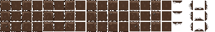

.. _basic-tile:

Basic Tile
==========

Tiles are the building blocks of Crea's terrain and architecture. Tiles can 
have specific functionality such as the Ice tile which cause characters to
slip and slide or the Ember Foliage which emits fiery particles when stepped
on. Tiles can also be purely decorative or thematic like the Dots Wallpaper or
Snow.

Let's head over to the Crea directory (and if you don't know how to navigate
there, take a minute to look over 
:ref:`where it's located and how it's structured <locating-crea>`), and then
into mods/core/tile, and we'll go over a very basic tile, Dirt.

Dirt
----

We'll start off by taking a look at the spritesheet, dirt.png:

Each row of sprites contains visual variations, but the important thing to note
is the difference between each column. Each column represents a different
situation for the tile. 

Going from left to right: 

* No other tiles surrounding it
* Tile above
* Tile to the right
* Tile above and to the right.
* Tile below
* Tile above and below
* Tile below and to the right
* Tile above, below, and to the right
* Tile to the left
* Tile above and to the left
* Tile to the left and to the right
* Tile above, to the left and to the right
* Tile below and to the left
* Tile above, below and to the left
* Tile below, to the left, and to the right
* Tile on all sides

Now let's take a look at the source code, dirt.ce:

.. code-block:: python
   :linenos:

    from core.template.item import Tile, ScrapTier

    from siege.graphic import Color

    dirt = Tile(
        name = "Dirt",
        durability = 30,
        priority = 1000,
        level = 3,
        groups = ['soil', 'natural'],
        sounds = 'dirt',
        particleColor = Color(100, 76, 50),
        mapGroundColor = Color(100, 80, 60),
        mapWallColor = Color(80, 60, 40)
    )

    dirt.isItem(
        classification = "Mineral",
        stack = 999,
        sellPrice = 0,
        scraps = ScrapTier.One
    )

Like :ref:`Basic Items <basic-items>`, we start off by importing the template.
We start off by initializing an instance of that template and storing it in a
variable 'dirt'.

The following lines define that Tile. 'Name' represents the name of the tile.
Durability is the number of hit points the tile has before breaking. Sounds
define what sound is played when the tile is hit and on tile break.
'ParticleColor' is the color of the particles that are emitted on hit and
break. 'MapGroundColor' and 'mapWallColor' are the colors that are displayed
within in the in-game map.

The last block of code adds an ItemComponent to the entity, and more
information can be found within the :ref:`basic-items`.
