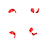
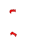
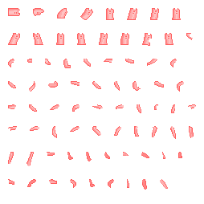
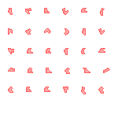
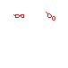

.. _character-customizations:

Character Customizations
========================

Character customizations include everything that is used when creating a new character: hair, shirt, accessories and so on.
This also includes new body types aka races.

.. _hair-customizations:

Creating New Hair
-----------------

Creating new hair is easy to do. Inside of mods/mymod/customization/hair create a .ce file with the name of your hairstyle such as mods/mymod/customization/my_hair.ce.
In it you will want something to the affect of the following.

.. code-block:: python

    from core.template.customization import Hair

    Hair(name="MyHair")

If your hairstyle only has a top part (short hair) then you will want to include topOnly=True.

.. code-block:: python

    from core.template.customization import Hair

    Hair(name="MyShortHair", topOnly=True)

See mods/core/customization/hair/ for more examples.

.. _shirt-customizations:

Creating New Shirts
-------------------

Creating new shirts is easy to do as well. Inside of mods/mymod/customization/shirt create a .ce file with the name of your shirt such as mods/mymod/customization/my_shirt.ce.
In it you will want something to the affect of the following.

.. code-block:: python

    from core.template.customization import Shirt

    Shirt(name="MyShirt", bodyTypes=['hm'])

One additional thing to note here is that the body type(s) can be specified to limit who can use this customization.

.. note::
    You can specify the body type(s) for any customization!

.. code-block:: python

    Shirt(name="MyShirt", bodyTypes=['hm', 'hf'])

.. _pant-customizations:

Creating New Pants
------------------

Creatings new pants is just as straight-forward as the other customizations. Inside of mods/mymod/customization/pants create a .ce file with the name of your pants such as mods/mymod/customization/my_pants.ce.
In it you will want something to the affect of the following.

.. code-block:: python

    from core.template.customization import Pants

    Pants(name="MyPants")

.. image:: images/my_pants.png

.. shoes-customizations:

Creating New Shoes
------------------

Shoes are as simple as they come. Inside of mods/mymod/customization/shoes create a .ce file with the name of your pants such as mods/mymod/customization/my_shoes.ce.
In it you will want something to the affect of the following.

.. code-block:: python

    from core.template.customization import Shoes

    Shoes(name="BasicShoes")

Creating Accessories
------------------

Accessories are a bit more involved but not by much. Inside of mods/mymod/customization/accessory create a .ce file with the name of the accessory such as mods/mymod/customization/my_glasses.ce.
In it you will want something to the affect of the following.

.. code-block:: python

    from core.template.customization import Accessory

    Accessory(name="Glasses", slot=1)

Since there are two accessories slots you must specify which slot the accessory should be associated with.

.. _customization-graphics:

Customization Graphics
-----------------

Creating new Customizations largely consists of creatings the graphics. You will notice that generally the graphics are a red tint.
This is because changing the customizations color in game uses `HSL <https://en.wikipedia.org/wiki/HSL_and_HSV>`_.

If you wish to not support coloring for a customization then you may do so in the graphic and inside the .ce file provide canColor=False.

.. code-block:: python

    from core.template.customization import Pants

    Pants(name="RainbowPants", canColor=False)
