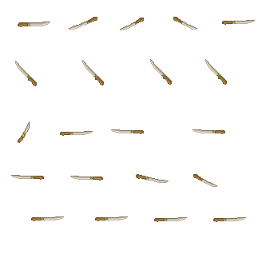
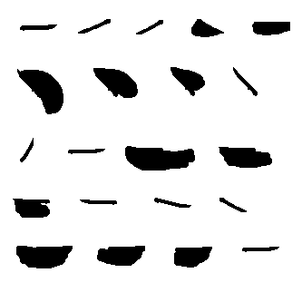
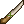
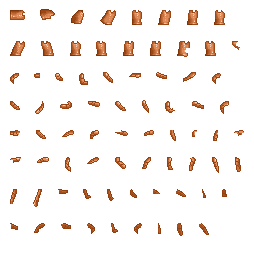
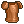

Basic Gear
==========

In this section, we'll take a look at some source code from very simple gear
already in the game to get you on the right track. Like basic items, weapons
and armor are all content entities. Each piece of gear requires a content entity
file (.ce), a sprite sheet which includes all of the animations matching the 
existing animations of the player, and an icon file to be used when the gear
isn't equipped.

Weapons that deal damage during the attack animation, such as swords and spears,
also require a mask sprite sheet. These image files care copies of the animation
sprite sheet with every frame colored black. These mask files are used by the
Crea engine to accurately define and map the weapon's hit box in game.

Now that you have a general overview on the structure of gear in Crea, let's
look more closely at some practical implementations.

Bone Sword
----------

We'll get started with a very simple sword. Let's head over to the Crea
directory (and if you don't know how to navigate there, take a minute to look
over :ref:`where it's located and how it's structured <locating-crea>`), and then
into mods/core/item/weapons/.

For reference, here are the image files for the Bone Sword:

Main Sprite Sheet:

Mask of the Sprite Sheet:

Icon file:

The Crea engine automatically syncs the animations with the player sprite so
you'll have to have your sprite sheets structured the same way.

Now, let's take a look at the source code:

.. code-block:: python
   :linenos:

    from core.template.item import createPotentials, Genus, Sword, StatAttribute

    sword = Sword(
        name = "BoneSword",
        power = 22,
        level = 1,
        experience = 15,
        price = 25,
        materials = [
            Genus('lumber', quantity=5),
            Genus('bone', quantity=2),
            Genus('vine', quantity=6),
        ]
    )

    sword.equippable(
        slot = "weapon",
        levelRequired = 1,
        potentialCount = createPotentials(50, 150),
        potentials = [
            StatAttribute('ATK', valueRange=(2, 4), weight=5),
            StatAttribute('HP', valueRange=(3, 6), weight=2)
        ]
    )

Like we discussed in the :ref:`Basic Items Section <basic-items>`, the
beginning of .ce and .py files contain the imports. Here, we are importing the
createPotentials function, the Genus template, the Sword template, and the
StatAttribute attribute. 

Line 3 instantiates a Sword and assigns it to the variable 'sword'. The
following lines up to the closing parenthases ')' are parameters defining the
Bone Sword. Each line contains a keyword argument that is used by the engine.
Keep in mind that you can't toss any sort of value here because the Crea engine
will not understand how to use it.

Here we have a Sword with the name "BoneSword". It has a 'power' of 22. 'Power'
is the value used when calculating the base damage dealt by the weapon (and for
more information on damage calculation, see <link for Combat>). 'Level' defines
the crafting level required to craft the weapon and 'experience' is the base
experience the player will receive when crafting it. 'Price' defines how much an
NPC will sell the weapon for. The player is able to sell the weapon to an NPC
1/5 of that price. The last keyword argument 'materials' takes a list of 
materials that are required to craft the Sword.

The Sword template is actually a child class that inherits the values from the
Item template we discussed in the :ref:`Basic Items Section <basic-items>` and
in the :ref:`Advanced Items Section <advanced-items>`. That is why some of the 
keyword arguments may seem familiar. The key difference is that the Sword
template defines the attack animations for us as well as some default values for
Weapon specific values such as SP cost, attack type, and damage type.

The Sword template also adds and defines a default Equipment Component to the
Weapon. The Equipment Component is what makes the Sword Item equippable.

.. code-block:: python
   :linenos:
   :emphasize-lines: 17-25

    from core.template.item import createPotentials, Genus, Sword, StatAttribute

    sword = Sword(
        name = "BoneSword",
        power = 22,
        level = 1,
        experience = 15,
        price = 25,
        materials = [
            Genus('lumber', quantity=5),
            Genus('bone', quantity=2),
            Genus('vine', quantity=6),
        ]
    )

    sword.equippable(
        slot = "weapon",
        levelRequired = 1,
        potentialCount = createPotentials(50, 150),
        potentials = [
            StatAttribute('ATK', valueRange=(2, 4), weight=5),
            StatAttribute('HP', valueRange=(3, 6), weight=2)
        ]
    )

The highlighted section on lines 17-25 redefines the default Equipment
Component. Here we are redefining it to add potential StatAttributes to the
weapon. We'll discuss how to create and add Gear Attributes in a later section.

Bronze Armor
------------

Now, let's go over a very simple piece of armor. Let's head over to the Crea
directory (and if you don't know how to navigate there, take a minute to look
over :ref:`where it's located and how it's structured <locating-crea>`), and
then into mods/core/item/armor/chest.

The first thing to note is that spearate sprite sheets have to be made for male
and female characters. Each sprite sheet contains animations to fit character
actions and animationsn in game. The naming convention has .ce file name
matching the male character's sprite sheet, and the female character's sprite
sheet matching with the same name with _hf added at the end.

bronze_armor.png:

bronze_armor_hf.png:

bronze_armor_icon.png:

Now, let's look over the source code. I've removed the 

.. code-block:: python
   :linenos:
   :emphasize-lines: 22

    from core.template.template import Substitute
    from core.template.item import Item, Material, StatAttribute

    bronzeArmor = Item(
        name = "BronzeArmor",
        unique = True,
        price = 70
    )

    bronzeArmor.craftable(
        category = "Armor",
        subcategory = "Chest",
        level = 4,
        experience = 50,
        serviceRequired = "Forge",
        materials = [Material('bronze_ingot', quantity=5)]
    )

    bronzeArmor.equippable(
        slot = "chest",
        levelRequired = 4,
        visuals = [Substitute('shirt')],
        attributes = [
            StatAttribute('DEF', valueRange=(2, 5)),
            StatAttribute('MIND', valueRange=(2, 4))
        ]
    )

Note is that there is no template specific to armor. This is because Armor is
simply an Item with an EquipmentComponent added to it. This is one of the many
advantages to the Entity-Component design philosophy. 

The key to armor is the EquipmentComponent. The 'visuals' keyword is what 
substitutes the default player visuals with the armor sprite sheet. What you see
happening on line 22 is the spritesheet being placed on top of the area
designated as shirt on the player sprite.

The player sprite components that can be replaced are:

* 'helmet'
* 'shirt'
* 'pants'
