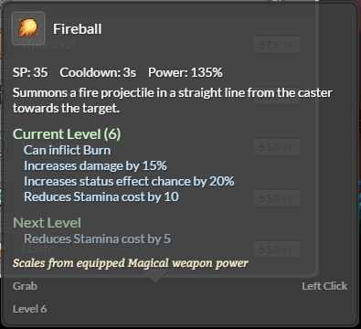

.. _talents-and-skills:

Talents and Skills
==================

Talents are mainly used as a means to group skills together usually around a theme such as crafting.
Actions related to a talent can yield talent points (TP) which can then be used to level up skills within the talent.
Skills can either be passive and are always in effect or be active and require the player to use the spell.

Talents and skills are only intended for players and are added via the :mod:`TalentsComponent`.
Talents are added to the :ref:`body content <creating-races>` which gets transferred to the player once the body is selected.

Adding New Talents
------------------

Entirely new talents can be created and added to either new or existing body types.
To create a new talent start by creating a new ``.py`` file in the mods/mymod/talent/ directory such as mods/mymod/talent/cooking.py.

Any assets needed for the talent, such as icons and skills, should go in a subdirectory, mods/mymod/talent/cooking/.
Inside of cooking.py we want to provide a function that creates a new :mod:`Talent`.

.. code-block:: python

    from core.talent import addSkill
    from siege import game, Talent

    def getTalent():
        talent = Talent("cooking", "cooking/icon.png", [1000] * 50)
        addSkill(talent, ChopSkill)
        addSkill(talent, SpiceSkill)
        game.events['create_talent'].invoke(talent)
        return talent

See the :py:func:`Talent constructor <Talent.__init__>` for the signature details.
After creating a talent the :py:func:`create_talent` event should be invoked.

When adding the talent to a new body type then it can be inlined. See :ref:`Creating Races <creating-races>` for more thorough details.

.. code-block:: python

    import siege.component
    import core.talent.cooking

    talents = siege.component.Talents()
    talents.talents.append(core.talent.cooking.getTalent())
    body.addComponent(talents)

When adding the talent to an existing body then you will want to utilize the :py:func:`setup_body` event.
Inside of cooking.py you can add the following code along with adding a :ref:`registration call <mod-registration>`.

.. code-block:: python

    def addTalent(template, identifier):
        if identifier == 'hm':
            template.talents.talents.append(getTalent())

    def register():
        game.events['setup_body'].listen(createTalent)

Adding New Skills
-----------------

Creating new skills is a much more complicated task but there are some tools to help simplify things.
As long as you have a :mod:`Talent` you can easily add a skill to it with :py:func:`addSkill` in ``core.talent.addSkill`.

.. py:function:: addSkill(talent, skill)

    Adds the skill to the talent.

    :param Talent talent: The talent to add the skill to.
    :param skill: The skill to add to the talent. This can either be an instance of a BaseSkill or a class inheriting from BaseSkill.
    :type skill: BaseSkill class or instance

Skills can either be passive which are always in effect or active which requires use.
Each skill will need to have a :ref:`skill tuning data <skill-tuning>` associated with it.

Passive Skills
^^^^^^^^^^^^^^

Passive skills can range from a simple stat boost to much more complicated skills such as giving a damage boost ever 5 attacks.
For the most basic passive skill where you just need to track the skill level because you use logic elsewhere you can use ``PassiveSkill.create`` from ``core.talent``
All you just have to do is pass in the related :ref:`skill tuning data <skill-tuning>`.

.. code-block:: python

    addSkill(talent, PassiveSkill.create(SkillTuning.WAND_PROFICIENCY))

When creating a stat boost skill it is almost the same but instead use ``StatBoostSkill.create`` from ``core.talent``.

.. code-block:: python

    addSkill(talent, StatBoostSkill.create(SkillTuning.MIND_BOOST))

Slightly more involved skills will require you to create a new class and derive from ``core.talent.PassiveSkill``.
Whenever a skill is activated, such as when it is learned, the ``onActivate()`` method will be called.
Similarly whenever a skill is deactivated the ``onDeactivate()`` method will be called.
Be sure to use these properly by reversing everything in ``onDeactivate()`` that ``onActivate()`` did.

On occasion you will need to perform an action only on the client and not the host.
This can easily be done by using the analogous ``onClientActivate()`` and ``onClientDeactivate()``.

In the example below you can see that we add a listener to :py:func:`use_delay` event in ``onActivate()`` and then remove the listener in ``onDeactivate()``.

.. code-block:: python

    class ToolSpeed(PassiveSkill):
        TUNING = SkillTuning.TOOL_SPEED
        MODIFIERS = ['STAT_AMOUNT']

        def onActivate(self, level, player):
            player.entity.event["use_delay"].listen(partial(ToolSpeed.handleUseDelay, level))

        def onDeactivate(self, level, player):
            player.entity.event["use_delay"].remove(partial(ToolSpeed.handleUseDelay, level))

        @staticmethod
        def handleUseDelay(level, item, delay):
            if item.has("tool"):
                delay.final -= int(delay.start * (getTuningData(ToolSpeed.TUNING, level, 'STAT_AMOUNT') / 100.0))

Active Skills
^^^^^^^^^^^^^

Active skills must be used from the toolbar to take effect.
Skills are expected to be usable and consequently require a ``onUse()``.
Skills on a client can also perform logic by providing ``onClientUse()``.

.. py:class:: ActiveSkill

    .. method:: onUse(player, level, position, toolItem, isModified)
        Called when the player has used the skill and it should perform whatever actions it does.

        :param Player player: The player performing the skill.
        :param int level: The current level of the skill.
        :param Vector position: The position the player's cursor is targeting.
        :param ToolItem toolItem: The item on the toolbar this skill is being used from.
        :param bool isModified: Whether the player is holding down the modifier button while using the skill.

    .. method:: onClientUse(player, level, position, toolItem, isModified)
        Called on a client when the player uses a skill. This should only perform immediate graphical changes such as playing an animation.

        :param Player player: The player performing the skill.
        :param int level: The current level of the skill.
        :param Vector position: The position the player's cursor is targeting.
        :param ToolItem toolItem: The item on the toolbar this skill is being used from.
        :param bool isModified: Whether the player is holding down the modifier button while using the skill.

    .. method:: isAvailable(player, level, toolItem)
        Called when checking if this skill is available for use. When unavilable the skill will be grayed out on the toolbar.
        When unprovided the skill is assumed to always be available.

        :param Player player: The player performing the skill.
        :param int level: The current level of the skill.
        :param ToolItem toolItem: The item on the toolbar this skill is being used from.
        :returns: Whether the skill is available or not.
        :rtype: bool

    .. method:: isUsable(player, level, position, toolItem)
        Called when checking if this skill can be used. This is only called when the skill is available.
        When unprovided the skill is assumed to always be usable.

        :param Player player: The player performing the skill.
        :param int level: The current level of the skill.
        :param Vector position: The position the player's cursor is targeting.
        :param ToolItem toolItem: The item on the toolbar this skill is being used from.
        :returns: Whether the skill is usable or not.
        :rtype: bool

    .. method:: canRepeatUse(player, level, position, toolItem, isModified)
        Called when checking if this skill can be repeatedly used without releasing the action button.
        When unprovided the skill is assumed it can be used repeatedly.

        :param Player player: The player performing the skill.
        :param int level: The current level of the skill.
        :param Vector position: The position the player's cursor is targeting.
        :param ToolItem toolItem: The item on the toolbar this skill is being used from.
        :param bool isModified: Whether the player is holding down the modifier button while using the skill.
        :returns: Whether the skill can be repeatedly used.
        :rtype: bool

There are a few base classes available to help make active skills easier.
``core.talent.UsableSkill`` is the main bass class and provides a great number of default methods that may be overridden.
There are several classes that derive from this class:
``core.talent.ArmsSkill``, ``core.talent.RangeSkill``, ``core.talent.SpellSkill``, and ``core.talent.SpellForm``.
The first three are used to determine which stats are used to calculate the skill's power.
``core.talent.SpellForm`` is for skills that change when the player channels a different Aer such as ``core.talent.syle.BaseForm``.

Skill Modifiers
^^^^^^^^^^^^^^^

Most skills have multiple levels and as they are leveled up will be modified in some way.
To help convey this information we have a list of ``MODIFIERS`` as a class attribute.
The listed modifiers correspond to a value in the tuning data.
The game automatically detects when the modifier value changes or will change for a given skill level and display it in the tooltip.

The following is an example of a skill with modifiers and what it looks like in game.

Excerpt from mods/core/talent/syle.py

.. code-block:: python

    class BaseForm(SpellForm):
        TUNING = SkillTuning.BASE_FORM
        DEFAULT_AER = SkillTuning.CHANNEL_AEGNIX
        MODIFIERS = ['POWER', 'STATUS_EFFECT_CHANCE', 'SP_COST']

Excerpt from mods/core/tuning/skill.py

.. code-block:: python

    BASE_FORM = AttrDict(
        NAME = "BaseForm",
        TYPE = "Base",
        DESCRIPTION = "BaseFormDesc",
        ICON = "mods/core/talent/syle/base_icon.png",
        ICON_TEMPLATE = "mods/core/talent/syle/base_{}_icon.png",
        UNLOCK_LEVELS = [1, 1, 7, 12, 17, 23, 30, 35, 40, 45],
        LEVEL_COSTS = [0, 350, 375, 375, 375, 400, 400, 400, 400, 450],
        CAST_TIME = 500,
        COOLDOWN = seconds(3),
        POWERS = [120, 120, 126, 126, 126, 135, 135, 135, 145, 145],
        SP_COSTS = [45, 40, 40, 35, 35, 35, 30, 30, 30, 25],
        TP_AMOUNT = 12,
        TP_CHANCE = 30,
        STATUS_EFFECT_CHANCES = [0, 0, 0, 0, 20, 20, 20, 40, 40, 40],
        SOUND = "mods/core/audio/sfx/talent/syle/fire.ogg",
        SOUND_TIMING = 300
    )

Modifiers can be associated with more than just a number.
In addition to numbers, modifiers can be a time, text or a name of content.
The type of modifier, specified with a value from ``core.talent.SkillModifierTypes``, can be paired with the name as a ``tuple``.

.. code-block:: python

    MODIFIERS = ['POWER', 'RANGE', ('COOLDOWN', SkillModifierTypes.Time)]

.. class:: SkillModifierTypes

   .. data:: Int
   .. data:: Content
   .. data:: String
   .. data:: Time

Awarding Talent Points
----------------------

Whenever a player performs an action related to a talent the player should at least have a chance to gain some talent points.
Generally actions yield somewhere between 20-50TP based on the ease and frequency the action is performed.
This is achieved with either :py:func:`chanceToGainTalentPoints` or :py:func:`gainTalentPoints`.
Here is an example gaining craft talent points after a craft finishes by listening to the :py:func:`craft_finish` event.

.. code-block:: python

    from core.talent import chanceToGainTalentPoints

    def craftFinish(player, results, craft, count, result, item, remainder):
        level = craft.level
        rate = int(min(120 * math.sqrt(float(count)), 220))
        amount = craft.experience * (level / 5 + 1) * min(count, math.sqrt(count) * 2)
        chanceToGainTalentPoints(player, player.entity.talents.craft, level, rate, amount)

.. py:function:: chanceToGainTalentPoints(player, talent, level, rate, amount)

    Chance to grant talent points to the player's talent. The higher the ratio is between the provided level and your talent level the more talent points will be gained with a higher likelyhood.

    :param Player player: The player that may gain the talent points.
    :param ActiveTalent talent: The talent to gain the talent points.
    :param int level: The level of the action that resulted in this being called.
    :param int rate: The likelyhood that the talent points will be gained. 0 is never and 255 is very likely.
    :param int amount: The amount of talent points to award. This changes depending on the level matchup.

.. py:function:: calculateTpPoints(player, talent, level, rate, amount)

    Calculates how many talent points should be gained.

    :param Player player: The player that may gain the talent points.
    :param ActiveTalent talent: The talent to gain the talent points.
    :param int level: The level of the action that resulted in this being called.
    :param int rate: The likelyhood that the talent points will be gained. 0 is never and 255 is very likely.
    :param int amount: The amount of talent points to award. This changes depending on the level matchup.
    :returns: The amount of talent points that should be gained.
    :rtype: int

.. py:function:: gainTalentPoints(player, talent, amount)

    Grants talent points to the player's talent.

    :param Player player: The player that may gain the talent points.
    :param ActiveTalent talent: The talent to gain the talent points.
    :param int amount: The amount of talent points to gain.
