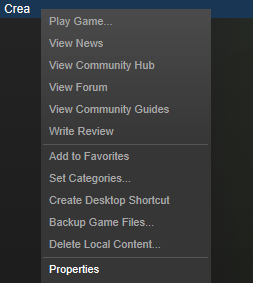
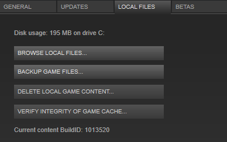

.. _understanding-crea:

Understanding Crea Files
========================

Locating the Crea Directory
-----------------------------

Open Steam and go to your library, then right click on Crea and click on the "Properties" option.



Click on the "Local Files" tab then click "Browse Local Files..." button from that page. This will open the Crea directory in your file browser.




.. _directory-structure:

Directory Structure
-------------------

You know where the files are, and your text editor is all setup. Let's take a
look at the basic structure of a mod. Files can be placed however you want
inside a mod. However, there are a few files that are needed or are treated
specially.

* Crea/

  * crea.log
  * settings
  * mods/

    * your_mod/

      * __init__.py
      * info
      * preview.png
      * registration.py
      * coremod/

**Crea/**
    This is the root directory for Crea.

**crea.log**
    This log file contains a great deal of information about what is happening
    in Crea. With advanced modding you can also add logs in the code.

**settings**
    The settings file is mostly exposed to the in game settings however at times
    you may wish to change values directly such as set "developer_mode" to true.

**mods/**
    This directory is where all mods are stored. Note that the core game
    directory is also located here. Feel free to use it as reference!

**your_mod/**
    Create a directory that suits the mod you're going to be creating. Be sure
    to follow the naming convention of all lower-case letter and underscores
    instead of spaces.

**info**
    The info file contains mod information that Steam Workshop uses. This file
    must be in the `JSON Format <http://www.json.org/>`_.

    * title: This field is a string that contains the title of your mod. Note
      that this will be displayed on the Workshop page as is.
    * author: This string should contain the name you want to display on the
      Steam Workshop page.
    * description: String field that describes briefly what your mod provides.
    * version: This is a float that Steam checks to make sure that any players
      subscribed to your mod have the latest version. Make sure to increment
      this value whenever you make changes.

**preview.png**
    This image file provides a preview screenshot of what your mod adds and
    provides. The Steam Workshop page that is generated for your mod will use
    this image.

**registration.py**
    The game engine looks for this file specifically. Packages listed here will
    have their ```register``` method called and let the game engine know that
    these packages need to be used.

    For most basic mods, this registration.py will look like this::

        def register():
            pass

**coremod/**
    Allows for modification of python code in the core package. Code placed here
    can inherit and overload the existing code base.


File types
----------

When modding in Crea there are several file types to
be aware of.

* *.ce*   - Content Entity file which represents a type of content such as a single monster or item (Python file treated specially by the game)
* *.py*   - Python file used for systems
* *.png*  - Image file used by the game
* *.scml* - `Spriter <http://www.brashmonkey.com/spriter.htm>`_ character file used for modular sprites


Behavior of .ce Files
---------------------

Content Entity files (.ce) represent a piece of content within the game such as a
monster or item. It's actually a Python file that is treated differently by the game.

* .ce files are loaded automatically on game startup.
* Imported functions can be called, but as a general rule, don't contain code.

  * The exception to this rule is customizing (or decorating for those of you that know Python).


Behavior of .py Files
---------------------

You'll want to encapsulate functions and game logic for your .ce files into .py
files. Python files (.py) are only run when called on. Keeping logic separated
is good for performance because it'll only be loaded when called.
